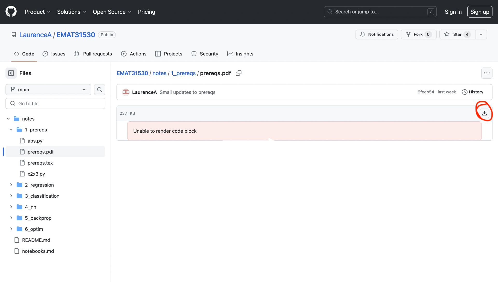

# SEMT20003: Introduction to AI
The course will introduce AI, with a focus on neural networks in PyTorch.

## Staff
- [Laurence Aitchison](http://www.gatsby.ucl.ac.uk/~laurence/) [laurence.aitchison@bristol.ac.uk] (unit director)

## Teaching Block Structure
* This course runs in TB2.

## Prerequisites
Linear algebra, basic statistics, basic Python.

## Course Structure

The course is taught in a "flipped classroom model".  So there are no in-person lectures (we wouldn't be able to schedule them anyway given the wide range of cohorts on the course).  Instead, there are extensive pdf notes, iPython notebooks and videos.  Then, you can ask questions through the 2-hour weekly TA-led problem classes. <!--, and the 1-hour weekly lecturer-led QA session (see Feedback below).-->

## Course Materials
Course materials for each week will be posted here on Monday.  Course materials each week will include some combination of:
* Notes
  - There are pdf notes for every week of taught material.
  - The notes are often long-ish, but that's only because I'm trying to be _thorough_ (e.g. I'm trying to include all the steps in derivations).  So the notes shouldn't in general be very dense.
  - The pdf notes will _usually, but not always_ include questions.
  - All questions will have worked answers.
* Notebooks
  - Each week, there will _usually, but not always_ be iPython notebooks, discussing practical aspects of training neural networks.
  - These iPython notebooks _occasionally_ have exercises.
  - The concepts in the iPython notebooks are examinable (see Exam section below for details on how code will be examined).
  - You don't learn code (well) by just reading.  Even if I haven't done exercises, open up your own Colab notebook alongside and type the code in to follow along.  Try the things that I'm doing.  Try something a bit different!
* Videos
  - There are always videos of me going through the pdf notes, and may sometimes be videos of me going through the iPython notebooks.
  - _Watching the videos isn't necessary!!!_  The videos just go through (slowly and thoroughly) the material in the underlying pdf notes / iPython notebook.  So if you read + understand the underlying notes / notebooks, the videos are not necessary.
  - To reiterate, the exam is based on the notes/notebooks, _not_ the videos.

## Synchronous sessions.
* TA-led labs/problem classes on (TBD).
  - *This is time set aside for you to work on the exercises in the pdf notes + CoLab notebooks for that week.*  There will be TAs present to answer any questions.
<!-- * Online, lecturer-led QA sessions, Thursday 4-5pm in TB1.  Held as a Teams meeting from the course Team.
  - Again, this is for feedback on all parts of the course, including lectures, notes, questions, iPython notebooks, past exams and the group coursework.
  - A couple of you will have clashes.  Apologies.  Timetabling have worked hard to minimize clashes, but it isn't actually possible to eliminate clashes, given the wide range of cohorts on the course.  The sessions will be recorded, and you can e.g. ask some else to submit your question.
  - Please do remind me if I forget to record! -->

## Why PyTorch
All the notebooks are going to be in [PyTorch](https://pytorch.org).  These days, you _need_ to know PyTorch if you're doing AI:
* PyTorch is currently the leading AI library, both for academic research, and industry.
* Fantastic docs + tutorials + libraries (better than any other library)
* Pythonic and hackable: you can look at + modify the source for just about anything
* PyTorch is great for learning AI, because it exposes alot of the underlying concepts, and doesn't hide them under abstractions.
* As we'll see, you can use PyTorch as GPU-enabled-numpy, so it is useful for many applications outside of traditional AI.

Other points:
* You won't need to install PyTorch.  All the iPython notebooks in the taught material are presented using [Google Colab](https://colab.research.google.com).

## Exam
* These exams are in the standard TB2 assessment period.
* The exam will be a 2 hour, 20 question, multiple choice, in-person exam.
* The exam is primarily based on the material in the pdf notes.
* But the material in the CoLab notebooks is examinable.  I may ask in-detail about the material in the first week's CoLab notebooks (as you can see from Q1 and Q2 of the sample exam).  For instance, you should know what `t.ones(2,3,4)` or `A.mean(2)` does (along with the material in the GPU and intro to Python notebooks).  You aren't expected to know the material in the rest of the CoLab notebooks in that level of detail.  Specifically, the material in the rest of the CoLab notebooks may be examined in a couple of ways:
  - The CoLab exams can illustrate examinable concepts (e.g. Q7 and Q10 in the sample exam).
  - You may need to read more neural-network-y code, but where all information required would be clearly available in the code itself.  For instance, I could ask for a verbal description of the following neural network layer: `nn.Sequential(nn.Linear(in_features=100, out_features=200), nn.ReLU())`. I could give then several possible descriptions, with the correct description being: "A linear layer that takes vectors with 100 features and returns feature vectors with 200 features, followed by a relu nonlinearity".  But I wouldn't ask you to do that for `nn.Sequential(nn.Linear(100, 200), nn.ReLU())` as the code doesn't tell you what argument is `in_features` and which is `out_features`, and you really should to look it up to be sure.
* Things have changed quite alot since I took over the course, so the previous EMAT31530 exam is relevant, but nothing before that.
* The exam will focus on the _concepts_ rather than requiring you to learn specific math equations / PyTorch functions.
* [Instructions for MCQ exams](exams/OMR-student-intructions.pdf)
* The formula sheet in the sample exam is the same as that in the paper.
* As regards the need to memorise other equations, all I able to say is that types of knowledge required for questions in the sample are exactly the same as in the real exam.

<!--
## Practice exam!
[practice exam](exams/sample.pdf)

[practice exam answers](exams/sample_answers.pdf)
-->
## Other resources:

* [The little book of deep learning](https://fleuret.org/francois/lbdl.html)
* [3Blue1Brown (YouTube Channel)](https://www.youtube.com/c/3blue1brown)
* [Deep learning book](https://www.deeplearningbook.org)
* [Andrej Karpathy's course on building neural networks, from scratch, in code.](https://karpathy.ai/zero-to-hero.html)
* [Harvard Annotated Transformer](https://nlp.seas.harvard.edu/annotated-transformer/)
* Usually searching Google for a given topic will give a bunch of blog posts on the subject (often in places like [Towards Data Science](https://towardsdatascience.com))

## Downloading the notes

To download the notes, use the download button highlighted with the red circle:

## Weekly material (from 2023/24; there will be some updates for 2024/25)

#### Week 1: Prereqs and intro to PyTorch

We have students from quite a few different cohorts on this course.  So I'm going to try to go over at least some of the prerequistes here.  Even if the notes look easy, please do skim through to the end, and check out the exercises.  

In any case, there will definitely be material you haven't seen in notebook 1.2 (Introduction to PyTorch) and notebook 1.3 (GPUs with PyTorch).

| Notes/Notebook | Video (if available) |
| ---- | ---- |
| [notes](notes/1_prereqs/prereqs.pdf) | [notes video 1 (28:22)](https://uob.sharepoint.com/:v:/t/grp-LA/EcJ4IReynmZPpNCG2_kUMnIBguvkENLttVZaime8khzJKg) |
| | [notes video 2 (11:01)](https://uob.sharepoint.com/:v:/t/grp-LA/ESKjudaYaNlDulbC6qj6Ta8BWvM2NOWyxYcWVcE49eB0qQ) |
| | [notes video 3 (39:18)](https://uob.sharepoint.com/:v:/t/grp-LA/EWRUqCzSRNpAt-i2HtF-ArIBkkeeCretxXofdvK4WtWmOg) |
| | [notes video 4 (09:39)](https://uob.sharepoint.com/:v:/t/grp-LA/EfPjwXBcVi9MkbaicNi4qE8Bn7tgxawpb6aZ1pug9kETXA) |
| [Notebook 1.1: Introduction to Python](https://colab.research.google.com/drive/18jGWurFiWTrvcz_OLiWF46xuaTVvYDww?usp=sharing) | N/A |
| [Notebook 1.2: Introduction to PyTorch](https://colab.research.google.com/drive/1AV5pzM-9AIIDWldQZ6Id7XH8_yRGztGP?usp=sharing) | [notebook video (39:45)](https://uob.sharepoint.com/:v:/t/grp-LA/ESaKTjytko5Hjk4yMg-s1m8BNPJql5GrAGNf0foBA0i3FA) | 
| [Notebook 1.3: GPUs with PyTorch](https://colab.research.google.com/drive/1EjqE4eDioEdWJwWm_KnO0CPTds3LHKyC?usp=sharing) | N/A | 
| N/A | [Week 1 QA (23/24) (34:10)](https://uob.sharepoint.com/:v:/t/UnitTeams-EMAT31530-2023-24-TB-4-A/EXezUO44d2dBrZ2vyfWoyKIB4Cdcnj-MzMttYVCp3vGl_A) |

<!--
#### Week 2: Linear Regression

| Notes/Notebook | Video (if available) |
| ---- | ---- |
| [notes](notes/2_regression/regression.pdf) | [notes video 1 (24:57)](https://uob.sharepoint.com/:v:/t/grp-LAlectures/ER4Iry8y6ndItNCFzORtK6YBOzMyo96zjKgcPogap8L0uA) |
| | [notes video 2 (13:30)](https://uob.sharepoint.com/:v:/t/grp-LAlectures/EaVCMXsQp_lHjfygzWUdCREBOzaCsmyDvj4z17sasdK85g) |
| | [notes video 3 (23:43)](https://uob.sharepoint.com/:v:/t/grp-LAlectures/EZbSaoApXjVOvEKCf1f-A7kBOHhWlk-Bs4o4KP_9RonDxw) |
| | [notes video 4 (27:27)](https://uob.sharepoint.com/:v:/t/grp-LAlectures/Ee3CZ5XfG_NPsh_fCN4U-P0Bnfg0RPd63sa-N5tfzYSQsg) |
| [Notebook 2: Linear Regression](https://colab.research.google.com/drive/1wrgZfRJaWC-Hh_zgrDd-ubgdIAq0Qd_q?usp=sharing) | N/A |
| N/A | [Week 2 QA (19:40)](https://uob.sharepoint.com/:v:/t/UnitTeams-EMAT31530-2023-24-TB-4-A/EUD1dJvk0hZGhF1Ect2x9TYBd3ELuLXQLCgW1l0paMmZ5g) |

#### Week 3: Linear Classification

| Notes/Notebook | Video (if available) |
| ---- | ---- |
| [notes](notes/3_classification/classification.pdf) | [notes video 1 (21:56)](https://uob.sharepoint.com/:v:/t/grp-LAlectures/EdYiRNRTlEpDlyQwvCi7YzYBpESvfvI6xU-B9J5tS7-sDQ) |
| | [notes video 2 (24:31)](https://uob.sharepoint.com/:v:/t/grp-LAlectures/Ebnm32pzEaJOrBq743-UxOsByQpQ8SqRjJVPg23m_mztQA) |
| | [notes video 3 (22:41)](https://uob.sharepoint.com/:v:/t/grp-LAlectures/EaFZZAf4Bg5FofmwNDjWRUoBhpMXIBYRuthKn_EsU99FpA) |
| [Notebook 3: Linear Classification](https://colab.research.google.com/drive/1XuazbDaJA88AJbdsm9mcw_foBfyQR2bH?usp=sharing) | N/A |
| N/A | [Week 3 QA (10:51)](https://uob.sharepoint.com/:v:/t/UnitTeams-EMAT31530-2023-24-TB-4-A/EWRi1FtGS2xOsO13s_aeY4sB_LjNVc8jvvW-OuOaObElUw) |

#### Week 4: NNs

This week, we introduce NNs!
This week is a bit unusual, as the notes are very short, with no exercises, but I expect the Python notebooks to be more challenging.
That's because mathematically defining NNs is somewhat straightforward.
However, understanding how PyTorch implements NNs requires a bit more thought, especially if you're going to understand things well enough to do modifications/tweaks for research/real-world problems!

| Notes/Notebook | Video (if available) |
| ---- | ---- |
| [notes](notes/4_nn/nn.pdf) | [notes video 1 (19:32)](https://uob.sharepoint.com/:v:/t/grp-LAlectures/EQgb2YmkGuxLvrFdM20sjV4BWlh8SBXTqW3O4m5pFiucZQ) |
| [Notebook 4.1: Python classes](https://colab.research.google.com/drive/1aERh1n1RdUVZJR_9VwPdEtNzdjqYB21c?usp=sharing) | N/A |
| [Notebook 4.2: NNs in PyTorch](https://colab.research.google.com/drive/1UyJM01YKfxszLffd-F2EU2yTFxmKb7e9?usp=sharing) | N/A |
| [Notebook 4.3: NNs with torch.nn](https://colab.research.google.com/drive/1dXEYDmW7Bu31rC2ejkNXfdTHfwVO_vrC?usp=sharing) | N/A |
| [Notebook 4.4: NN exercises](https://colab.research.google.com/drive/1zjH9hiu7Q85fWRuL5vfvMpfsOTv4q0tn?usp=sharing) | N/A |

#### Week 5: Backprop

The key bit of magic in PyTorch is the ability to compute gradients of the loss through arbitrary compute graphs.
PyTorch does this using the backprop algoritm, and the backprop algorithm to compute gradients is at the heart of all modern AI.
This might be a bit tougher than other weeks, as it involves going back-and-forth between the math and the code.
But once you really understand backprop, you'll really know (and be able to reason about) what goes on in modern AI.

| Notes/Notebook | Video (if available) |
| ---- | ---- |
| [notes](notes/5_backprop/backprop.pdf) | [notes video 1 (20:06)](https://uob.sharepoint.com/:v:/t/grp-LAlectures/EbbvdyCRZRJMoa9YBt0SLKYB7R5FSZqzQPk6dr9352uomw) |
| | [notes video 2 (15:48)](https://uob.sharepoint.com/:v:/t/grp-LAlectures/ESL-W0p5tYJPriVWJrZdzzkBwHxvFDyGkiQKhHyPrAJIOQ) |
| | [notes video 3 (15:04)](https://uob.sharepoint.com/:v:/t/grp-LAlectures/EUow4gEqGHNNi7kRqL4oussB1Se_WQpl2qExDJx1F0Uv7w) |
| | [notes video 4 (20:59)](https://uob.sharepoint.com/:v:/t/grp-LAlectures/EZH1PMMjpXhKtu9rzWHtQSYBkQyrUV1qs_-48zrNNx7VBA) |
| [Notebook 5.1: Compute Graph](https://colab.research.google.com/drive/17aja1jqP-nrCZcQSTvMUVm1FkYrf_7ZM?usp=sharing) | N/A |
| [Notebook 5.2: Backprop](https://colab.research.google.com/drive/1A4Ne83U5Yp45Yivjo9baDC3LO7XyIhEs?usp=sharing) | N/A |

#### Week 6: Reading week!

#### Week 7: Optimization

Computing the gradients using backprop was the hard part.
But there still are a few tricks to using these gradients to quickly train NNs.
That's what this week is all about.

| Notes/Notebook | Video (if available) |
| ---- | ---- |
| [notes](notes/7_optim/optim.pdf) | [notes video 1 (21:17)](https://uob.sharepoint.com/:v:/t/grp-LAlectures/EYMScaA6QF1NjGhnKxUmGWgBG-Ralhi-0hw-j1-IQ0hguw) |
| | [notes video 2 (7:13)](https://uob.sharepoint.com/:v:/t/grp-LAlectures/EVZfCjSaIBRPvcVmGFB69QkB9j14ZtIq4zyeEB8mDaFOmQ) |
| | [notes video 3 (23:16)](https://uob.sharepoint.com/:v:/t/grp-LAlectures/EVUUejzjQvhLr7cTbPe30RsBb1uex86gLs3grQF1v48neg) |
| | [notes video 4 (24:00)](https://uob.sharepoint.com/:v:/t/grp-LAlectures/ERisNZHAOTpPtvwVGOjeBtYBJugU7BMwmf-Hn4aK7ez67w) |
| [Notebook 7.1 torch.optim](https://colab.research.google.com/drive/1S3bcYEUpeaXEMae0gRILxhIYN7EQcMHN?usp=sharing) | N/A |
| [Notebook 7.2 NNs for MNIST](https://colab.research.google.com/drive/1UA9-DSlbjoLp_vTYAi_bR7-6X6uvKMgi?usp=sharing) | N/A |

Major Updates post initial release:
* Proof of equivalence between the different formulations of SGD is now non-examinable.

#### Week 8: Overfitting

This week is a bit unusual, because I'd advise looking at the CoLab notebook first.  That notebook introduces overfitting and cross-validation in linear models.
The pdf notes then go on to talk about overfitting in neural networks.

**Note that there are no exercises this week.**

| Notes/Notebook | Video (if available) |
| ---- | ---- |
| [Notebook 8 Overfitting](https://colab.research.google.com/drive/1_adhLa3YMOnnmIS0sKkYvjToisFuWr3Z?usp=sharing) | [notebook video (16:47)](https://uob.sharepoint.com/:v:/t/grp-LAlectures/Eehq1IzytbFDpyT7l0N4z1kBzMOn7iQ3xCTPmzMI1JY6mw?e=IV8Op9) |
| [notes](notes/8_overfitting/overfitting.pdf) | [notes video 1 (17:01)](https://uob.sharepoint.com/:v:/t/grp-LA/Ee4MriT4lbtHs9c_x3bhaBwBGO2FLz-_Q5Xz85MDSwsSUw) |
|  | [notes video 2 (21:59)](https://uob.sharepoint.com/:v:/t/grp-LA/EQI-cw16ysBCovXNC0f2-IoBiMKDwYoXTdVWql4NkhJKqA) |

#### Week 9: CNNs

This week we'll look at architectures for neural networks for images.

**There are no exercises in the pdf notes this week, but there are exercises in the CoLab notebooks.**

| Notes/Notebook | Video (if available) |
| ---- | ---- |
| [notes](notes/9_cnn/cnn.pdf) | [notebook video 1 (28:33)](https://uob.sharepoint.com/:v:/t/grp-LAlectures/EVoYdfR1gdhIgJgyEPyUfDABpCfhDDkkshDNg8gj8CeVpg) |
| | [notebook video 2 (11:27)](https://uob-my.sharepoint.com/:v:/g/personal/ei19760_bristol_ac_uk/ERgnidh9URtDlUN0cHrthrgB6w_otIfknTJQsNyzAMi8YA) |
| | [notebook video 3 (18:24)](https://uob.sharepoint.com/:v:/t/grp-LAlectures/EQ1Kg8lHCqNFg055rGfnCCABQORuJkKhxcTchU31H9k5mA?e=uRUsme) |
| [Notebook 9.1 Convolutions](https://colab.research.google.com/drive/1A7nPFBzJLneS7e1FAMPbi8s2aCQ_SfG_?usp=sharing) | N/A |
| [Notebook 9.2 CNNs](https://colab.research.google.com/drive/1Myg8Ge9ubyRariUV1G0CGGbgiAheftuw?usp=sharing) | N/A |

#### Week 10: Large language models (LLMs)

This week we'll take a very high-level look at modern large language models.

**There are no exercises in the pdf notes this week, but there are exercises in the CoLab notebooks.**

| Notes/Notebook | Video (if available) |
| ---- | ---- |
| [notes](notes/10_llms/llm.pdf) | [notebook video 1 (8:30)](https://uob.sharepoint.com/:v:/t/grp-LAlectures/EUpV3cefSAFHmt72QTKa8VgBa4tmOA06c5goOgR5EOgRZA?e=gmusoy) |
| | [notebook video 2 (12:04)](https://uob.sharepoint.com/:v:/t/grp-LAlectures/EVfJV1I7gMhMkiwhiId0rcQBHDuOZCH6buF1XKQID3d0lA?e=lQMfup) |
| | [notebook video 3 (20:58)](https://uob.sharepoint.com/:v:/t/grp-LAlectures/EdbMDBxkAhNAs_b5Dlgm8HoBsaS0UAeus0V_uEbouxk8mg?e=hSA77f) |
| [Notebook 10.1 Strings](https://colab.research.google.com/drive/11fXTOUD_XJw3aRFQd2SQHxMFsLAqfuoq?usp=sharing) | N/A |
| [Notebook 10.2 Tokenization](https://colab.research.google.com/drive/1y-9Ezr6Kfn74QDtD-rqyF_JRH3zAEZNW?usp=sharing) | N/A |
| [Notebook 10.3 Attention](https://colab.research.google.com/drive/1wLaBNwbHT10UkvSuHfO6wgtrAqmqVkpg?usp=sharing) | N/A |

#### Week 11: Revision
[practice exam](exams/sample.pdf)

[practice exam answers](exams/sample_answers.pdf)

The lecturer led QA on  7th December and lab session on  8th December are running.  You may use the lab to go through the practice exam, and you may ask the TA/lecturer about the practice exam, or about anything else that comes up as part of your revision.

#### Week 12: Revision

The lecturer led QA on 14th December and lab session on 15th December are running.  You may use the lab to go through the practice exam, and you may ask the TA/lecturer about the practice exam, or about anything else that comes up as part of your revision.
-->
